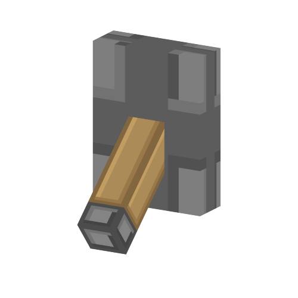

# BEScript_lever-particle

### Introduction

The Lever Particle Addon enhances your Minecraft experience by adding visually appealing particle effects to powered levers. This captivating addon brings a new level of interaction and immersion to your world, making every lever flip an enchanting event.

### Features

- **Particle Effects**: Adds a redstone wire dust particle effect around powered levers.
- **Efficient Management**: Uses a custom linked list to efficiently manage and update particle effects.
- **Seamless Integration**: Works seamlessly with your existing Minecraft world without affecting performance.

### How It Works

The addon listens for lever actions and triggers particle effects around powered levers, providing a visual indicator of their state.

> Requires chat and lever events

### Installation

1. **Download the .mcpack file**: [GitHub Download](https://github.com/WavePlayz/BEScript_lever-particle/)
2. **Import the Addon**: Double-click the .mcpack file to import it into Minecraft.
3. **Activate the Addon**: In Minecraft, go to your world settings, click on "Behavior Packs", and enable the Lever Particle Addon.
4. **Enable Experimental Features**: Ensure that the "Experimental Beta APIs" toggle is turned on in your world settings.
5. **Enjoy**: Load your world and experience the enhanced lever visuals.

### Usage

- **Toggle Particle Effects**: Use the command `./toggle leverParticle` if you have the required tag.
- **No Configuration Needed**: Works out of the box with no additional setup required.

### Example Scenarios

- **Redstone Contraptions**: Easily identify which levers are powered in your complex redstone contraptions.
- **Adventure Maps**: Enhance the visual appeal of your adventure maps by adding particle effects to levers.
- **Creative Builds**: Add a magical touch to your creative builds with sparkling lever interactions.

### Support and Feedback

For any issues or suggestions, reach out on Discord: @waveplayz. Your feedback is invaluable.

